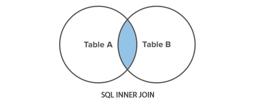
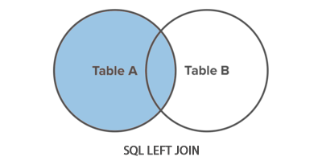

# SQL Workshop

Date: 10th, Apr, 2024  
Time: 14:00 pm - 16:00 pm  
Place: Maker Space  

* [Background](#Background)
* [Session](#Solution)
  * [Preparation](#Preparation)
  * [Data](#Data)
  * [Session 1](#Session-1)   
  * [Session 2](#session-2-subquery-with-and-join)


## Background.
Hosted by Hertie Coding Club, the SQL Workshop aims for introducing basic SQL to the student.  
With R and Python, SQL is also one of the most important programming languages in data relevant fields (data scientist, data analytics). Therefore, we decided to hold this workshop. 

## Session 
The workshop consists of two sessions. The first is **basic SQL**, and the second is **Advanced SQL**.

### Preparation 
Originally, for learning SQL, installing DataBase Management System (DBMS) is preferable. But it takes too long and the file size is also too large. So, for a smooth workshop, we will use **R programming** together. That is, this workshop is based on **SQL** and **R**. Therefore, installing R studio is necessary.

### Data 
In the worshop, we handle **energy trading** data. Specifically, the database name is `trades.sqlite`. And in the database, two table exists: `epex_12_20_12_13`,`epex_user`. We will talk about `epex_user` later in [JOIN](#3-join) session. **This table is about selling and buying a unit of electricty.**. And it also include what strategy (strategy_1, strategy_2) used 
|      id|  quantity|price |side |strategy  |
|--------|----------|------|-----|----------|
| trade_1|        5 |   20 | buy |strategy_1|
| trade_2|       17 |   10 |sell |strategy_1|
| trade_3|       15 |    8 | buy |strategy_1|
| trade_4|       13 |   35 |sell |strategy_2|
| trade_5|       23 |   11 |sell |strategy_2|
| trade_6|        8 |   20 | buy |strategy_2|

The schema is as follow: 

```sqlite
id TEXT PRIMARY KEY,
quantity INTEGER NOT NULL,
price REAL NOT NULL,
side TEXT NOT NULL CHECK (side IN ('buy', 'sell')),
strategy TEXT NOT NULL
```

### Session 1 

#### 1. SELECT * FROM {table name}
This is a basic of basic. If you want to see all rows, just select all(*) from table. For example,
```sqlite
SELECT * FROM epex_12_20_12_13
```

Or if you want to calculate something (e.g. average of price), you can calculate like below.

```sqlite
SELECT AVG(PRICE) FROM EPEX_12_20_12_13
```

As you already saw, the SQL doesn't discern between a capital letter and a small letter. So you can type "EPEX_12_20_12_13" instead of "epex_12_20_12_13"   

#### 2. SELECT * FROM {table name} WHERE {condition}  
If you want to add condition, use "WHERE" sentence. For example, 
```sqlite
SELECT * FROM EPEX_12_20_12_13 WHERE SIDE = "buy"
```
This query results in rows of which side is "buy."

#### 3. SELECT {criterion}, {calculation} FROM {table name} WHERE {condition} GROUP BY {criterion}

If you want to see the sum of quantity when buying electricity in each strategy, the query is following 

```sqlite
SELECT STRATEGY, SUM(QUANTITY) FROM EPEX_12_20_12_13 
WHERE SIDE = 'buy' GROUP BY STRATEGY
```

### Session 2: Subquery, With, and Join 

If you want to do more complicate query, `Subquery` and `With` statements are inevitable.  
For example, for solving the next question, we can use subquery way (1) and with statements way (2)  

Question: Select rows which have price higher than average price

#### 1. Subquery  

You can think the below query for solving the above question, but unfortuately it doesn't work (At thie time, SQL is inconvenient)

```sqlite
SELECT * FROM EPEX_12_20_12_13 WHERE PRICE > AVG(PRICE)
```
So, we need subquery. Subquery means literally "query in query". In the session 1, we got the average price in the table

`SELECT AVG(PRICE) FROM EPEX_12_20_12_13`

We use the query for solving the session 2 question like below

```sqlite
SELECT * FROM EPEX_12_20_12_13 WHERE PRICE > 
(SELECT AVG(PRICE) FROM EPEX_12_20_12_13)
```

#### 2. With

Besides of putting the query into the query, we can make temporary table using `with` statements. For example, we can make an interim table names `ABOVE_AVG` in which all rows are higher than average price

```sqlite
WITH ABOVE_AVG AS (
SELECT * FROM EPEX_12_20_12_13 WHERE PRICE > (SELECT AVG(PRICE) FROM EPEX_12_20_12_13)
)

```

And we just select all rows from `ABOVE_AVG`. The result is our answer for session 2 question


```sqlite
WITH ABOVE_AVG AS (
SELECT * FROM EPEX_12_20_12_13 WHERE PRICE > (SELECT AVG(PRICE) FROM EPEX_12_20_12_13))

SELECT * FROM ABOVE_AVG
```

#### 3. JOIN

Congratulations!! We solved our problem! Now, we turn to the other topic, which is very important. 

#### Added Data 

For Join, we need at least one more data. In the `trades.sqlite`, there is a table named "epex_user". 

|      id|  name| side|
|--------|------|-----|
| trade_1| Minho|  buy|
| trade_3| Lonny|  buy| 
| trade_4|Daniel| sell|
| trade_7|  Miri|  buy|

And below is the scheme. 

```sqlite
id TEXT PRIMARY KEY,
name VARCHAR(255)
```

##### 3.1 Inner Join



First, let's see inner join. 

```sqlite
SELECT * FROM EPEX_12_20_12_13 AS A 
INNER JOIN EPEX_USER AS B 
ON A.ID = B.ID 
```

There are two important points here.

1. Each table has to be aliased for convienece.

First, if you don't set alias, the query is getting crazy. When you just want to select `quantity` column in a join table, the query has to be below. 

```sqlite
SELECT EPEX_12_20_12_13.QUANTITY FROM EPEX_12_20_12_13 INNER JOIN EPEX_USER ON EPEX_12_20_12_13.ID = EPEX_USER.ID 
```
But if you use alias, the query becomes simpler

```sqlite
SELECT A.QUANTITY FROM EPEX_12_20_12_13 AS A INNER JOIN EPEX_USER AS B ON A.ID = B.ID 
```
2. The join criterion is "Primary key" (non-null and uniqueness)

Besides of ID column in both tables, there is one more common column, `side`. If you try to join based on this column, you can see the problem. 

```sqlite
SELECT * FROM EPEX_12_20_12_13 AS A 
INNER JOIN EPEX_USER AS B 
ON A.SIDE = B.SIDE  
```

So the join has to be on `Primary Key`, which is non-null and has uniqueness. 

##### 3.2 Left Join (Outer Join)



Now, we are going to see "Left join" (a.k.a Outer Join). In inner join, only rows having common ID (primary key) are extracted. But sometimes, you feel necessity for maintaining one of the tables as a whole.  
Let's see an example.

```sqlite
SELECT * FROM EPEX_12_20_12_13 AS A 
LEFT JOIN EPEX_USER AS B ON A.ID = B.ID
```

Of course, you can select specific columns like inner join 

```sqlite
SELECT A.ID, B.NAME 
FROM EPEX_12_20_12_13 AS A 
LEFT JOIN EPEX_USER AS B 
ON A.ID = B.ID  
```
